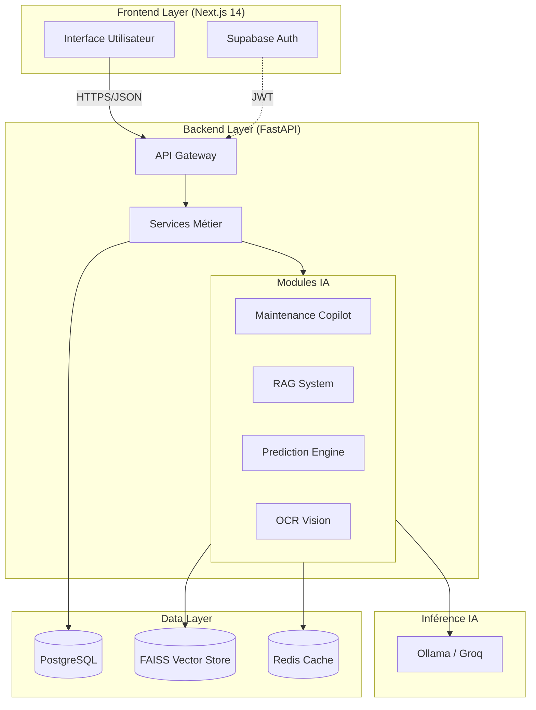
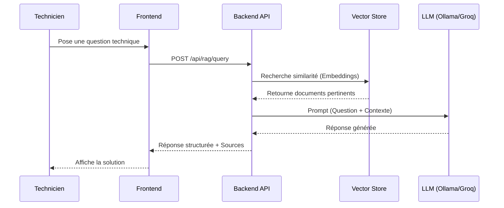

# ProAct GMAO

**Système de Gestion de Maintenance Assistée par Ordinateur (GMAO) Augmenté par l'IA**

[](https://nextjs.org/)
[](https://fastapi.tiangolo.com/)
[](https://www.postgresql.org/)
[](https://ollama.ai/)
[](LICENSE)

## Vue d'Ensemble

**ProAct** est une solution GMAO moderne conçue pour l'industrie 4.0. Elle combine une gestion rigoureuse des actifs industriels avec des capacités d'intelligence artificielle avancées (RAG, Copilot, OCR, Prédiction) pour optimiser la maintenance préventive et corrective.

L'objectif est de réduire les temps d'arrêt non planifiés en fournissant aux techniciens et superviseurs des outils d'aide à la décision basés sur les données.


## Architecture du Système

Le projet repose sur une architecture moderne et découplée, facilitant la maintenabilité et l'évolutivité.



## Fonctionnalités Clés

### Gestion Métier
- **Équipements** : Suivi du cycle de vie, hiérarchie, et historique des pannes.
- **Interventions** : Création, assignation et suivi des ordres de travail (OT).
- **Stock & Pièces** : Gestion des inventaires et alertes de seuil critique.
- **Techniciens** : Gestion des profils, compétences et plannings.
- **AMDEC** : Analyse des modes de défaillance, de leurs effets et de leur criticité (RPN).

### Intelligence Artificielle
- **Maintenance Copilot** : Assistant conversationnel pour diagnostiquer les pannes et suggérer des actions.
- **RAG (Retrieval-Augmented Generation)** : Interrogation en langage naturel de la documentation technique (manuels PDF, historiques).
- **OCR Intelligent** : Extraction automatique de données depuis des rapports papiers ou plaques signalétiques.
- **Predictive Maintenance** : Prévision des pannes (MTBF) et estimation de la durée de vie restante (RUL) via Machine Learning.

## Flux de Données (Data Flow)

Le diagramme suivant illustre le flux de traitement d'une requête d'assistance technique par le système RAG :



## Installation & Démarrage

### Prérequis Technique
- **Runtime** : Node.js 18+ & pnpm
- **Langage** : Python 3.11+
- **Infrastructure** : Docker (recommandé pour la base de données et services IA)

### 1. Configuration Backend

```bash
cd backend
python -m venv venv
# Activation (Windows)
.\venv\Scripts\activate
# Activation (Linux/Mac)
source venv/bin/activate

pip install -r requirements.txt

# Configuration des variables d'environnement
cp .env.example .env
# Éditer .env avec les identifiants base de données
```

### 2. Configuration Frontend

```bash
cd frontend
pnpm install

# Configuration env
cp apps/web/.env.local.example apps/web/.env.local

# Lancement en mode développement
pnpm dev
```

## Configuration IA (Hybride)

Le système supporte le basculement entre inférence locale et cloud :

| Variable | Description |
|----------|-------------|
| `LLM_PROVIDER` | `ollama` (local, privé) ou `groq` (cloud, rapide) |
| `OLLAMA_BASE_URL` | URL de l'instance Ollama (défaut : `http://localhost:11434`) |
| `GROQ_API_KEY` | Clé API requise si le provider est défini sur `groq` |

## Documentation

La documentation technique détaillée est disponible au format PDF dans le dossier `docs/`.

## Crédits

**Auteurs** : Mohamed Amine Darraj, Adam Khald  
**Encadrement** : Mr Tawfik Masrour, Mme Ibtissam Elhassani  

*Projet Académique - Génie Industriel*
