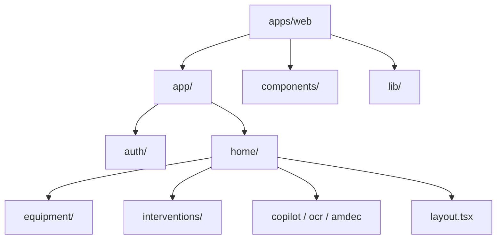

# ProAct GMAO - Frontend

## Vue d'Ensemble

Le frontend de **ProAct** est une application web moderne de type Single Page Application (SPA) / Server-Side Rendering (SSR) construite avec **Next.js 14**. Elle offre une interface utilisateur réactive, performante et professionnelle pour la gestion de maintenance industrielle.

L'application utilise le **App Router** de Next.js pour une gestion optimisée des routes et des layouts.

## Stack Technologique

*   **Framework** : [Next.js 14](https://nextjs.org/) (App Router)
*   **Langage** : TypeScript
*   **UI Library** : [React 18](https://react.dev/)
*   **Styling** : [Tailwind CSS](https://tailwindcss.com/)
*   **Composants** : [shadcn/ui](https://ui.shadcn.com/) + Radix UI
*   **Gestion d'État** : React Query (TanStack Query)
*   **Validation** : Zod + React Hook Form
*   **Authentification** : Supabase Auth (SSR & Client)
*   **Icônes** : Lucide React

## Architecture du Projet

Le code source est organisé selon une structure modulaire dans `apps/web` :



### Dossiers Clés

*   `apps/web/app/` : Routes de l'application (Pages & Layouts).
*   `apps/web/components/` : Composants UI réutilisables (Boutons, Cards, Tableaux).
*   `apps/web/lib/` : Utilitaires, clients API (GmaoApiClient), et hooks personnalisés.
*   `apps/web/app/home/` : Section protégée (Dashboard) contenant tous les modules métier.

## Modules Fonctionnels

L'application intègre les modules suivants :

1.  **Dashboard** : Vue d'ensemble des KPIs (MTBF, MTTR, Disponibilité).
2.  **Gestion des Équipements** : Inventaire et suivi des machines.
3.  **Interventions** : Planification et clôture des ordres de travail.
4.  **Intelligence Artificielle** :
    *   *Copilot* : Assistant conversationnel.
    *   *RAG* : Base de connaissances interrogable.
    *   *OCR* : Numérisation de documents techniques.
    *   *Prédictions* : Analyse prédictive des pannes.

## Installation et Démarrage

### Prérequis

*   Node.js 18 ou supérieur
*   pnpm (Recommandé) ou npm

### Installation des dépendances

```bash
cd frontend
pnpm install
```

### Configuration

Créez un fichier `.env.local` dans `apps/web/` basé sur `.env.local.example` :

```bash
NEXT_PUBLIC_SUPABASE_URL=votre_url_supabase
NEXT_PUBLIC_SUPABASE_ANON_KEY=votre_cle_publique
```

### Lancement en Développement

```bash
pnpm dev
```

L'application sera accessible sur [http://localhost:3000](http://localhost:3000).

## Scripts Disponibles

*   `pnpm dev` : Lance le serveur de développement.
*   `pnpm build` : Compile l'application pour la production.
*   `pnpm start` : Lance l'application compilée.
*   `pnpm lint` : Vérifie la qualité du code (ESLint).

## Bonnes Pratiques

*   **Typage Strict** : Tout le code doit être typé avec TypeScript/Zod.
*   **Server Components** : Privilégier les Server Components pour le data fetching initial.
*   **Client Components** : Utiliser `'use client'` uniquement pour l'interactivité (hooks, événements).
*   **Tailwind** : Utiliser les classes utilitaires pour le styling.

## Auteurs

*   **Mohamed Amine Darraj**
*   **Adam Khald**
